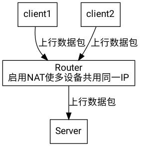

### Termux初始配置

首先，在Termux中从左向右滑动左边屏幕，出现白色侧栏，长按下方keyboard唤出特殊键。将出现的特殊键一栏向左滑，开启中文输入(严格来说是以词为单位的输入)。

也可以按音量上键+q.

然后把man装上……

```shell
pkg up; pkg in man
```

Bash来自GNU project，是大多数Linux发行版和Termux的默认Shell。也就是你正在使用的shell(应该是这样:D)

查看一下bash的使用手册

```shell
man bash
```
按`q`可以退出。

你可能意识到了，Linux的传统是将手册和应用包打包在一起。用man可以阅读用户手册。

```shell
man -k editor
#从所有手册中查找简介中有editor这个词的手册
---------------------
emacs(1) - GNU project Emacs editor
sed(1) - stream editor for filtering and transforming text
zshzle(1) - zsh command line editor
----------------------
```

这里的(1)是man手册的章节编号。假如我要阅读emacs(1)，我应该
```shell
man 1 emacs
```
不同章节的主题不同。
```
(1) -用户命令
(2) -系统调用
(5) -配置文件
……… #略过部分章节
(6) -游戏 #基本没有:D
(8) -系统命令与服务器
```

但有时我们只想简单的查看一下命令行选项，例如怎么都记不住选项的`tar`。那么`cheat`可以帮到你。

```shell
pkg in python -y
pip install cheat
```

运行一下试试看吧！

```shell
cheat tar | less
#依然按q退出
```

再也不用为tar发愁喽！

然而，有些工具，例如`termux-create-package`，它没有自带的man手册。别急，让我们执行一条命令。

```shell
pkg sh termux-create-package

---------------------------
Package: termux-create-package
Version: 0.7
Maintainer: Fredrik Fornwall @fornwall
Installed-Size: 36.9 kB
Depends: python
Homepage: https://github.com/termux/termux-create-package
Download-Size: 2880 B
APT-Sources: https://termux.net stable/main all Packages
Description: Utility to create Termux packages
-----------------------------
#快看，有homepage!
```

有homepage就有帮助可看了!

```shell
pkg sh termux-create-package 2> /dev/null | grep Homepage | awk '{print $2}' | xargs -I'{}' termux-open-url '{}'
```

浏览器将打开`termux-create-package`的[homepage](https://github.com/termux/termux-create-package)，看完你会发现，这是一个打包用的帮助脚本。

如果你想查看任意命令的帮助,例如ps(process scanner)，运行

```shell
ps -h

#或者
ps --help

#一般总有一个是对的
```
texinfo是另一个文档系统.

```bash
pkg in texinfo -y
```

查看emacs的手册

```bash
info emacs
```

github,stackoverflow,Archwiki,termuxwiki都是很好的文档查找地点。搜索引擎尽可能使用google(把cookie关上)，当然也有很多地方可以找到在线帮助。

当然了，我英文不好，所以我一般看中文手册。

+ https://i.linuxtoy.org/docs/guide/ch17.html

+ https://github.com/me115/linuxtools_rst

+ http://cn.linux.vbird.org/


### pkg和apt

Termux使用apt管理命令行程序，但使用pkg在日常使用中更有优势。

例如，安装Emacs系统时

+ apt

```shell
apt update
apt install emacs
```

+ pkg

```shell
pkg i emacs
```

另外，pkg有保护机制，禁止用户在用tsu提升权限后安装软件包。这很有好处，防止了某些事故。

不过，在某些特殊情况下，还是应该用apt。

例子：

```
$ apt install 'node*'

Reading package lists... Done
Building dependency tree
Reading state information... Done
Note, selecting 'nodejs' for glob 'node*'
Note, selecting 'nodejs-lts-dev' for glob 'node*'
Note, selecting 'nodejs-dev' for glob 'node*'
Note, selecting 'nodejs-lts' for glob 'node*'
Note, selecting 'nodejs-current' for glob 'node*'
```

apt完全支持通配符，而pkg有时不支持(有原因，此处不解释)。当然了，nodejs和nodejs-lts相冲突，所以上面那么整没意义。

所谓互相冲突，只是因为几个Package提供的文件有重复之处。例如，vim和vim-python相冲突，二者只能选一个。

可能Emacs系统也没那么有趣，删了吧。

```shell
dpkg -r emacs
```

dpkg是真正的本地包管理工具，源于Debian,它没有自动下载deb包的能力，日常基本不用。

+ 查看一个Package有哪些文件

```
pkg f emacs
```

输出很长，建议less加管道

+ 查看Package信息

```
pkg sh emacs
```

+ 搜索Package

```
pkg se emacs
Sorting... Done                       
Full Text Search... Done              
emacs/stable,now 26.1-2 arm [installed]     
Extensible, customizable text editor-a
nd more                                                               
mg/stable 20180927 arm                
microscopic GNU Emacs-style editor                                          
zile/stable 2.4.14-1 arm              
Lightweight clone of the Emacs text editor
```

根据Package信息进行查找，包括Pacage描述和包名。可以看到与emacs风格相似的mg和zile也被找出来了。


+ Package列表

```shell
apt list
```

+ 已安装Package列表

```shell
apt list --installed
```

如果有别人为Termux制作了一个deb包(假定它叫i2p.deb)，应该这样安装。

```
apt update
apt install --fix-broken ./i2p.deb
```

apt会自动处理依赖。


什么是依赖？C/C++程序有一个被称为共享库的机制，简单描述一下吧。

用户A编写了名为salt的程序，实现了几个简单的文件加密功能，但A不会加密算法。所以他在salt的源码中写下:

```
#include <crypt.h>
```

然后他就可以在程序中调用libcrypt库提供的几个加密函数了。

A把salt打成deb包发布了，在deb包的control文件里写下:salt依赖于libcrypt。那么apt安装salt时，自然会去先装libcrypt。

既然salt程序要用libcrypt库提供的函数，那么当然libcrypt这个包在安装salt之前要先安装。

所谓的依赖关系，就是因为程序调用了其他程序和库才形成的。

这造成了，非常多、非常多的麻烦。关于共享库，最好多了解一下，日后用得到。

库是不能直接用的(有些不是，如jq)，看看Termux的源里有几个库。

```shell
apt search library
```


**postinstall**

openssh包在安装时会自动创建几个文件，这是通过postinstall脚本实现的。

### /sdcard

Termux默认无法读写/sdcard下的文件，执行

```shell
termux-setup-storage
```

不过，还有一些问题。

如果文件名以连字符开头，例如

```
-Android_conf
```
那么你应该这样操作

```shell
vi ./-Android_conf
```

反正不要让连字符出现在开头。

还有很多文件名问题出现在/sdcard目录下，有一本小书可以起到很多帮助:https://github.com/jlevy/the-art-of-command-line/blob/master/README-zh.md

### RTFM

RTFM意为"Read The Fucking Manual"(读读该死的手册),还有一个词STFW(搜搜该死的网络)。如果你向别人提问时得到此回复，那么应该高兴，因为你的问题可以通过搜索和看手册解决。

### Unix

Unix最初指Bell实验室的两个人为了打游戏写出的一个操作系统。后来，Unix代表着一种设计理念和哲学。所有在实现中体现了Unix哲学的操作系统都是Unix家族的一员。`kiss`意为`keep it simple,stupid`,是常常被提到的一条Unix哲学。

简而言之，Unix是一个集合，可用于代指很多概念和名词(Unix玩家过于随意地解释Unix这个词，就像中国古代文言文中的“然”一样，这导致了很多争论)

### Unix哲学

通常所说的“Unix哲学”包括以下三条原则[Mcllroy]：

一个程序只做一件事情，并且把它做好。

程序之间能够协同工作。

程序处理文本流，因为它是一个通用的接口。
0
### 一切皆文件

Linux内核将一切都作为文件,还制造了一批不存在的文件。例如`/dev/null`，它是Linux上著名的黑洞文件，不管往里面写入多少数据，这个文件始终是空的。


### POSIX

`POSIX`是由RMS在上个世纪提出的，类Unix系统应遵守的一套标准。主要是为了方便开源应用跨系统移植和维护Unix生态的开放性。

### 曲径

尽管完全使用GUI就可以完成工作的类Unix是存在的(Mac osx)，但CLI更受传统派Unix玩家的欢迎。(GUI也很受欢迎，只是BSD,Linux一类的社区驱动的Unix在GUI方面不太给力)

CLI先于GUI出现，比GUI更古老，与GUI公路相比，它像一条羊肠小径。然而，小路给人更多乐趣(也更麻烦:D)，而且曲径有时比公路快。(有些批量任务需要复杂的命令行技巧，这不假，但在GUI下它们根本无法完成！)

>如果不会用命令行，那不是你的错。GNU/linux独有的精神是自由/justforfun，从unix那里继承的cli操作界面不见得就很好。如果一个人一味狂热地拥护所谓的"Unix哲学"却无视自由精神，那他肯定最终会滚入Mac的怀抱(除非没钱)。不过，既然来玩Termux了，该学还是要学一点的。

### 集市

现代Unix社区奉行集市式的软件开发模式，一个由社区驱动的类Unix系统，其内核，init，shell，编辑器，包管理工具往往由不同的组织或个人开发。说白了，合作精神。

### dot文件

文件/目录名如果以点( . )开头，则此文件/目录将被隐藏。

每一个目录中都有(.)和(..)两个特殊目录，(.)指向当前目录，(..)指向上一层目录。

### Var

变量是shell的一种特性，打个比方：

变量-->纸箱子。

变量的值-->纸箱里的水果。

shell变量-->只有当前shell才能打开的箱子。

环境变量-->任何子进程都可以打开的箱子。

shell变量里的水果只能是单个字符串。

接下来谈谈如何定义变量，这很简单。

```bash
ok=false
#定义一个名为ok的变量，值为false。
echo $ok
#将变量ok的值输出
#使用$<name>来使用一个变量的值。
export ok=false
#使用export这个shell内置命令设置环境变量。
#因为没有进程会去关心/访问ok这样一个环境变量
#所以无法演示
unset ok
#将变量ok"取消"掉，使其值为null
export PATH=/sbin
#这个命令效果倒是立竿见影
#不要慌，长按屏幕，点击More，再选择kill process即可
#回到Termux，终端恢复正常
```
上面这一堆操作是针对bash的，其他shell可能会有所不同。但概念是相同的。

一些对Termux很重要的环境变量：

```bash
echo $PATH
---snip---
/data/data/com.termux/files/usr/bin:/data/data/com.termux/files/usr/bin/applets
#PATH变量的值是一些以冒号分隔的目录，当你执行命令时，shell会去这些目录中寻找对应的可执行文件。
#排在前面的目录shell会优先查询
#对PATH内文件的改变shell不会实时查询，shell有一套"缓存"机制(hash)
#大多数时候"缓存"机制会加快命令执行速度，少数时候会带来一些问题
#未完结
```
使用printenv可以查看所有的环境变量。

在Linux发行版上，系统所需环境变量的定义依赖于/etc/profile这个初次启动shell时运行的shellscript.

在Termux上就不一样了，环境变量的定义不依赖于profile(profile的内容会被shell读取并作为命令执行，但经我查看，Termux的profile并没有定义任何一个环境变量……)，而由Termux主应用定义(如果你在bashrc里啥也没写，Termux照样运行得好好的。).`login`这个脚本也定义了几个环境变量。


注：以上对shell变量的介绍并不完全准确，主要原因是Fish这样的现代shell提供了很多特性，比如`set -U`。

### 配置Bash

`bash-it`应该是最受欢迎的bash配置框架了，它有丰富的主题和插件支持。bash-completion则提供一些补全脚本集。

```shell
#Install bash-it
(pkg in git; git clone --depth=1 https://github.com/Bash-it/bash-it.git ~/.bash_it)

#write bashrc
echo '#enable bash-it' >> ~/.bashrc
cat >> ~/.bashrc <<EOF
function bashit() {
export BASH_IT="${HOME}/.bash_it"
export BASH_IT_THEME='powerline-plain'
export SCM_CHECK=false
source "\${BASH_IT}"/bash_it.sh
}
bashit
EOF

#bash-completion
pkg in bash-completion -y

#会自动启用，详情见$PREFIX/etc/profile
```

z是一个强大的目录跳转插件:https://github.com/rupa/z

不过还是自己看着装吧,毕竟一般用不着。

bashmark是一个bash的目录书签插件:https://github.com/huyng/bashmarks

关于Prompt，使用gbt比较好

```shell
{
mkdir -p ~/.termux
pkg in git curl gbt
curl -O https://raw.githubusercontent.com/4679/oh-my-termux/master/.termux/font.ttf && mv font.ttf ~/.termux/font.ttf

#write bashrc
cat >> ~/bashrc <<EOF
#Go Bullet -- Go编写的bash prompt配置工具
export GBT_CARS='Dir, Sign'
#设定Prompt块
#Dir指目录
#Sign指Prompt前的箭头和用户信息
#还有一些块我不需要，没写

export GBT_CAR_DIR_FG='black'
#Dir块字体色为黑色
export GBT_CAR_DIR_BG='blue'
#Dir块背景色为蓝色
#BG为背景色
#FG为字体色
[ -x $(which gbt) ]&&export PS1='$(gbt)'
EOF
}
```

还得整一本bash语法书。

```shell
pkg i nodejs -y
npm install -g bash-handbook
```

打开中文版

```shell
bash-handbook --lang zh-cn
```

按q退出，按/进入搜索模式。


### 迁移到Zsh


安装`zsh-improved`

```shell
pkg in git make -y
git clone https://github.com/myfreess/Tzim \
	~/Tzim
cd ~/Tzim
make zim
```

### Fish

在一些资深Unix玩家的推动下，现代shell Fish出现了。就像fishshell自己说的那样：

>Fish是一个用户友好型的shell/Fish is a friendly interactive shell。

Fish会在补全时认真地思考，它会自动推导用户的意图。例如:

```shell

function hello --description Hello,users
echo Hello,(whoami)
end
```

接着执行

```shell
funcsave hel<tab>
-----------------------------------------
hello  (Save function)
help   (Save function)
-----------------------------------------
```
Fish自行推导出了用户的意图(保存函数)，并给出了适合的提示!


### omf

**Install**

```shell
curl -L https://get.oh-my.fish | fish
```

Fish在脚本方面较弱，但ohmyfish开发组还是写了不少插件。


### vi

```shell
pkg in vim -y
```

>问：如何生成一段随机字符串？

>答：让新手退出Vi

`vi`是Unix上的传统文本编辑器,很多人是vi的狂热粉丝，但显而易见，一般Termux用户平时也用不上几次。所以别为vi配置头疼了，快来用`micro`吧。

Termux的默认编辑器是busybox提供的vi而非vim，那有点过分简单了。

vi是一个基于模式的编辑器，一般有这几种模式：

+ 正常模式(也是进入vi时的默认模式)

+ 插入模式(这才是常用的文本编辑模式)

+ 可视模式(正常模式下按V)

+ 替换模式(正常模式下按R)

正常模式下按`i,a,o`中任意一个，可以进入插入模式。

退出vi,先按ESC，再输入:q!。如果想保存正在编辑的文件，按ESC然后按`:wq`。对了,` : `符号也要输入。

正常模式下按`k,j,h,l`分别代表光标上下左右移动。

接下来请看hacking vim一书。


https://github.com/wuzhouhui/hacking_vim

### Emacs

Emacs即EditorMACroS,宏编辑器

Emacs是用`EmacsLisp`和`C`编写的，那些键绑定对应的是一个个ELisp函数,而配置文件压根就是个EmacsLisp脚本。也就是说，要学会使用Emacs，必须学会ELisp。

首先打开emacs.

```shell
emacs
```

按`q`清屏。然后输入

```elisp
(insert "Hello,World!")
```

按下C-x,C-e(即Ctrl-x,Ctrl-e)

旅程开始！

按下`C-xC-e` 会在emacs最底部显示运行结果，也就是被称作"minibuffer"的区域

Elisp的基础单位是S表达式(被括号括起来的内容)，在Elisp的S表达式中进行数学运算是反直觉的。例如，1+1被写成:

```elisp
(+ 1 1)
```
这个语法绝对没错，因为我用emacs编写此文档(已经执行过啦).在这个例子中，1被称为原子符号。

setq可以为变量赋值

```elisp
(setq hy "hylang interpreter")
```

字符串必须用双引号包围。

defun可以定义函数

```elisp
(defun hello (user) (insert "\nhello," user))
(hello "u0a83")
------------
hello,u0a83
------------
```

format可以进行格式化的输出。

```elisp
(defun hello (user) (format "\nhello,%s" user))
(hello "u0a83")
```


接下来请看Elisp速成手册：https://segmentfault.com/a/1190000004910645


### Script

程序语言中有一个大的分类，被称为脚本语言(也被称为解释型语言)。它们允许你直接用解释器去运行脚本(即源码文件)，而不需要经历让人头痛的编译。python2/3,ruby,nodejs,php,lua是一些比较有名的脚本语言。

以python脚本hello.py为例，它的内容是这样的：

```python
import os
os.system(date)
print("Hello World")
```
应该这样运行它

```bash
python hello.py
```
大多数脚本可以用
`interpreter` `script`/ `解释器` `脚本` 的方式来运行，就像上面那样。但是，也许有时为了方便，你会把脚本或它的`symbol link`(符号链接)放到`$PATH`里，这样就可以方便地使用脚本了，这时我们要为脚本写一个`shebang`。

### shebang

shebang指脚本首行以`#!`开头的那行文本，它指定了脚本的解释器。Unix上python脚本的shabang一般长这样.

```
#!/usr/bin/python
```
有时长这样

```
#!/usr/bin/env python
```
很明显不适合Termux。执行`termux-fix-shebang <script>`可以修改脚本shebang。

`#!`后的内容一般是解释器的绝对路径。不过，如果要我说实话呢，Linux kernel会将`#!`后的内容作为一行命令，是的，可以传点参数什么的,但是只能传一个参数。不是说数量上只有一个，而是说不管在后面加多少参数，都作为一个整体传给解释器。

至于脚本余下的内容，将做为标准输入，给解释器。

### Bashscript

Bash可以在非交互模式下从文本文件获取标准输入，这个文件被称为Bashscript，它可以帮助Bash用户完成很多重复性工作。

例子:[chalk.sh](https://github.com/myfreess/chalk/blob/master/chalk.sh)

这是我自写的脚本,可以自动生成proot启动脚本,很方便。

Bash脚本不是简单的重复，Bash有条件分支，有循环，虽然语法很烂：|

Fish的语法更规范，Eshell的语法更强(可以说是真正的程序语言了)，但是Bash脚本使用最广。

讲个例子吧，我收藏了一个位于bilibili.com的视频，在bilibili.com搜索av45176488可以看到，上传者用钢琴弹奏了电影<流浪地球>的bgm_开启新征程_ 。我只想听，不想看。

首先找到blv文件，用realpath读出绝对路径，然后写jo本，用mpv播放。

```shell
function play {
mpv /storage/emulated/0/Android/data/tv.danmaku.bili/download/45176488/1/lua.flv360.bili2api.16/0.blv
}

while true; do
    play
done
```
也许有更好的方法,但我就这样了。

### Python

Python是一门面向对象的语言，有python2和python3两个分支。Python这门语言的解释器也叫`python`，Termux上默认的python是python3。

输入下面这条命令可以让你了解python的设计思想。

```
python -c "import this"
```

python有很多的模块，你可以用`pip`来管理python模块。对了，pip和pip2不一样。pip2适合python2编写的python模块,使用python2编写的模块只能用pip2安装。

当你使用错误的解释器运行脚本，将出现`syntax error`字样。

运行脚本时报错"no module named xxxx",就是说没有这个模块。`pip install xxxx`即可(pip版本要选对:D),不过，有时这个模块或此模块的依赖项半用python半用C编写，那么事情有点麻烦了。

+ 先试着安装python-dev pkg-config clang等编译所需工具,如果仍然报错则寻找报错信息中有无include<xxx.h>。 若有，则安装对应的dev包和lib包。(例如，缺失crypt.h，就把libcrypt和libcrypt-dev装上。)

+ 仍无法正确安装，则建议先在github的issues区自行搜索。没有可用方案时，可以自行创建一个issues，有时实际情况的确难以由用户自行解决。看看这里也行：https://wiki.termux.com/wiki/Instructions_for_installing_python_packages

+ 搜索引擎永远是我们的好帮手，经统计常见问题大概三分钟出解决方案，下面以pynacl的安装为例。官方的解决方案比较复杂，第三方方案则相当简单。

```shell
apt install clang python python-dev libsodium libsodium-dev
export SODIUM_INSTALL=system #bash or zsh
pip install pynacl
```

原解决方案出处:Pypi

原文如下：

```
PyNaCl relies on libsodium, a portable C library. A copy is bundled with PyNaCl so to install you can run:
$ pip install pynacl
If you’d prefer to use the version of libsodium provided by your distribution, you can disable the bundled copy during install by running:
$ SODIUM_INSTALL=system pip install pynacl
```

+ 去[euopkg](https://github.com/myfreess/euopkg.sh)看看也行。

+ its-pointless的社区仓库有opencv,numpy,scipy的预编译包:https://github.com/its-pointless/gcc_termux

### Daemons

守护进程是Unix的重要组成部分。算了，先动手吧:

```bash
eval "${PREFIX}/var/service/ftpd/run&"
```

这是Termux自带的一个脚本，运行后在127.0.0.1:8021开启一个ftp服务，现在你可以用任意ftp工具去连接了。方便你在其他机器上下载Termux Home目录的文件。不过，用户名和密码是啥啊……

反正记好，大多数人在Linux上用封装工具启动Daemon,但在Termux上行不通。所以不要指望复制粘贴能解决问题。

例子：

在Linux上启动lighttpd

```shell
/etc/init.d/lighttpd start
```

在Termux上启动

```shell
lighttpd -f lighttpd.conf&
#conf文件要自己写
```
原理完全不同。

在Android上，没有Root权限，你就无法让守护进程使用1024以上的高端口。(1~1023)

### NAT



路由器用一种名为NAT的技术将你和WildWildWeb隔开，所以如果在Termux上建站，别人应该访问不到(同路由下有可能),用ngrok和frp可以解决公网ip的问题。

### play-audio

放个音乐听听吧。

```shell
pkg in play-audio -y
```
### Graphviz

Graphviz是一个绘图工具包。有dot等多个绘图工具。还是让我们看看效果吧。

这是[NAT.dot](NAT.dot)

这是NAT.jpg


# 文档完结!
